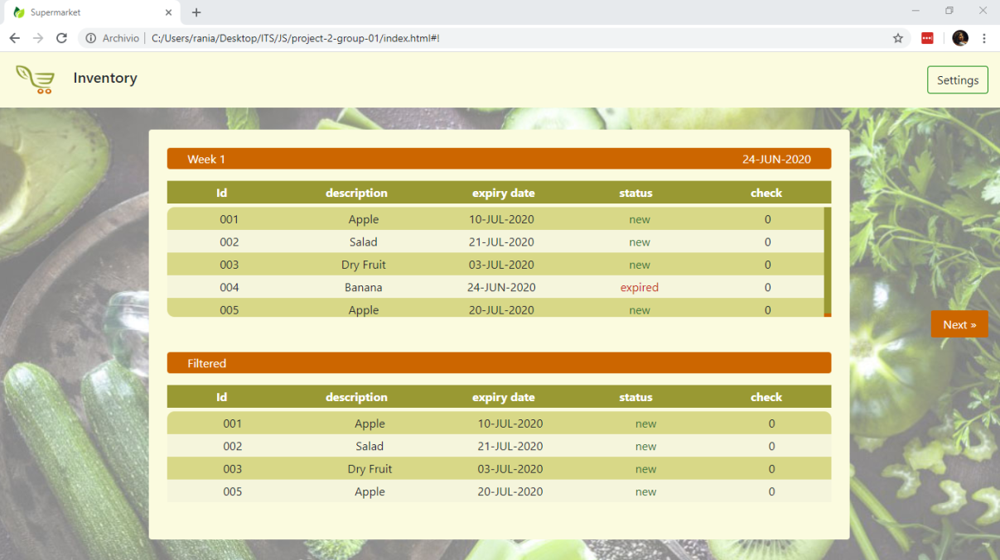
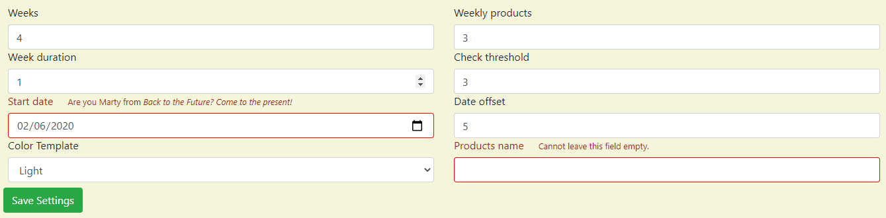
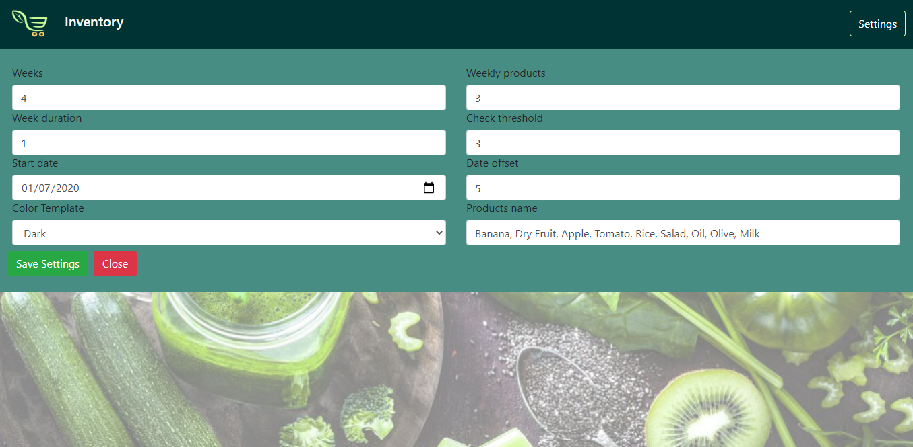
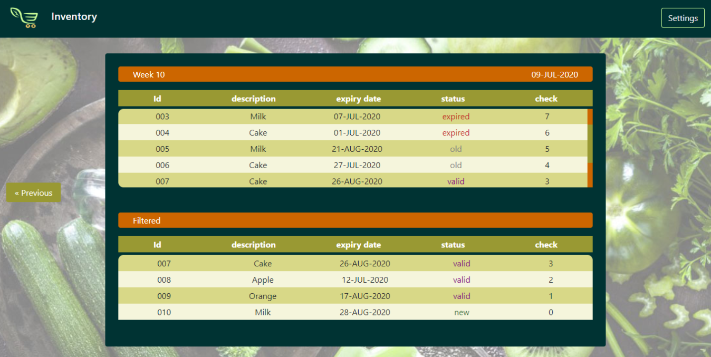

# Progetto Expiry List - Supermarket

---

# Introduction
> This program outputs a list of supermarket items filtered by expiry date,
  You can configure the program by using the settings menu

---

## Approach to solution / Project description

1) Create index.html structure by using bootstrap (only for design)
2) Connect html with JS for the settings setup (open form, save settings, close..)
3) Then we plan the logic structure of JS and develop it by using pieces of code from the previous project
5) Protect the global variables by using just one global variable called mySpace
6) We tested the entire program looking for possible bugs to fix by using the console
7) We tested the program with different browser every time we change something in the code
8) We improve the design look of the program
9) Generate JSdoc

---

## Files and project structure

- **`buttons.js`**
This file contains all the button settings and events

- **`database.js`**
This file contains all the database variables, settings and functions

- **`manager.js`**
This file contains all the manager settings and their relative functions

- **`product.js`**
This file contains all the products functions

- **`table.js`**
This file contains all the tables settings and functions

- **`main.js`**
This file contains the starting code of the program

---

## Configuration and technical characteristics
 The manager of the supermarket can setup the values by filling the form settings.

The manager cannot:
     
     - choose a starting date prior to the current one
     
     - leave the products name filled empty.

---

## Usage 
 The Supermarket program start with default values.
- The manager can change them by clicking the settings button:
  - Weeks: weekly runs the program
  - Weekly products: number of new products each week
  - Week duration: week duration in days
  - Check threshold: weeks of products on the shelf
  - Start date: the program start in date
  - Date offset: days to add to startdate
  - Color template: template mode(light or dark)
  - Names of products: products nouns

- By clicking **Next** and **Previous** buttons you can visualize the next or previous week, with their relative products.

- The status of the products is visible by the color:
  - New: Green
  - Expiry: Red
  - Valid: Purple
  - Old: Grey

---
## Browser compatibility
 - Google Chrome
 - Mozilla Firefox
 - Microsoft EDGE
 - IE11
 - Opera

---
## Version
 -   1.0 : design structure with html and css
 -   1.1 : set form animation with JS
 -   2.0 : restructured using bootstrap
 -   3.0 : wrote the logic structure of the database
 -   3.1 : added names of products and color template(light and dark) in the form settings
 -   3.2 : changed color of product status, added validation input check (Start date, Products names)
 -   3.3 : changed design detail, added spinner, fixed various bug
 -   3.4 : fixed 'Previous button' bug (it wasn't showing the correct previous date week)

## Technologies
Project is created with:
+ Visual Studio Code version: 1.43.1
+ Sublime text
+ Adobe Illustrator 2019

---
## Authors - TEAM
>GROUP 1

+ **Khazour Rania** (Project Manager)

+ **Ghigino Mirco** (Front-End Developer)

+ **Como Alice** (Designer & Front-End Developer)

+ **Picchi Alessandro** (Front-End Developer)

*NOTE*: We used the **Peer Programming Method**

---
## Validation
Validated HTML

Validated CSS

---
## License and contact information
*This software is a freeware*

 Contact:

- rania.khazour@edu.itspiemonte.it
- mirco.ghigino@edu.itspiemonte.it
- alice.como@edu.itspiemonte.it
- alessandro.picchi@edu.itspiemonte.it

